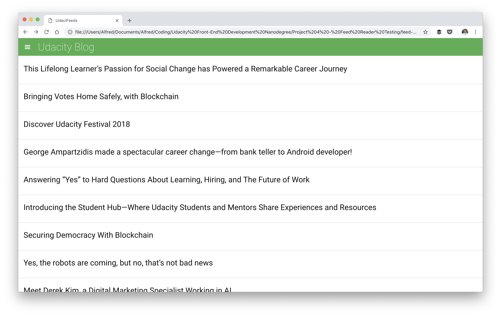

# Feed Reader

A feed reader for four blogs

## How to use the Feed Reader

1. Load the reader by opening the index.html file in a browser
2. Click on the hamburger menu icon to select another blog
3. Click on any title to read the blog post

## Dependencies

- HTML, CSS, and Javascript
- Jasmine

## Spotted a bug?

I'll be grateful if you tweet me about it at [@alfred_lua](https://twitter.com/alfred_lua)!

## Acknowledgement

Benjamin Cunningham's blog post, [Testing JavaScript with Jasmine — Basics](https://medium.com/letsboot/testing-javascript-with-jasmine-basics-48efe03cf973), helped me get unstuck a few times.